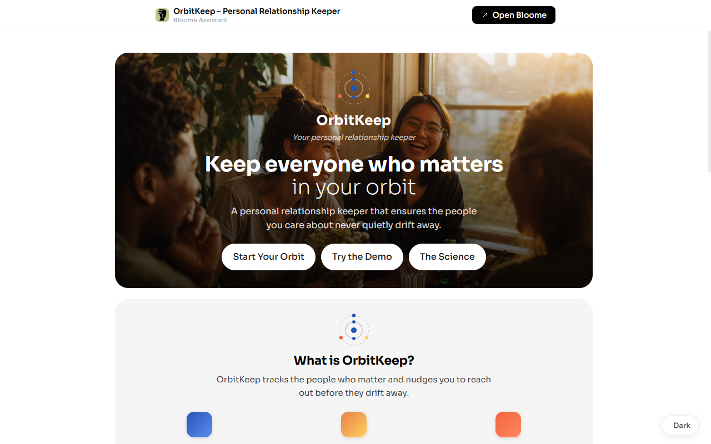
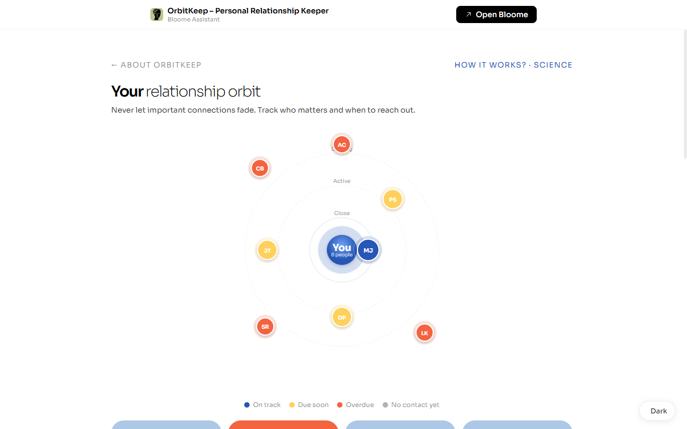
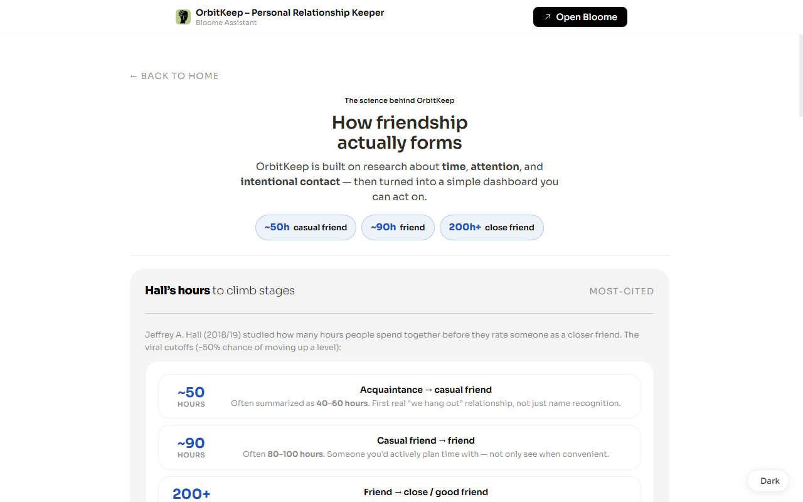

# OrbitKeep

**Personal Relationship Keeper** — keep everyone who matters in your orbit.

[](https://bloome.im/s/GXGsK4TI)
[](https://bloome.im/s/GXGsK4TI)
[](LICENSE)

OrbitKeep helps you track important people across Instagram, Discord, email, WhatsApp and more, set a contact cadence, and get nudged **before** the connection fades.

**Try it now → [bloome.im/s/GXGsK4TI](https://bloome.im/s/GXGsK4TI)**  
*(Bloome may ask you to log in to *interact*. Use **Continue browsing** to explore the demo, or **Try the Demo** for sample people.)*

---

<p align="center">
  
</p>

<p align="center">
  
</p>

<p align="center">
  
</p>

---

## Features

- **Relationship orbit** — visual map of people by closeness / due status (on track · due soon · overdue · no contact yet)
- **Interactive person cards** — tap a bubble for status, last contact, next due, platforms, quick log
- **Cadence engine** — `next_due = last_contact + frequency_days` with local calendar math
- **Demo + Start Your Orbit** — sample data for demos; clean slate for personal use
- **Science page** — Hall friendship-hours research + Dunbar layers, mapped to product metrics
- **Light / dark theme** — light by default, corner toggle

## Quick start

Open the live widget, or run it standalone (no backend):

```bash
# from this directory
python3 -m http.server 8080
# open http://localhost:8080
```

State persists in `localStorage`. Full Bloome features (`ResonWidget.state`, hosted theme) work best in the [live widget](https://bloome.im/s/GXGsK4TI).

## Product model

| Entity | Fields |
|--------|--------|
| Person | name, memo, platforms[], topics[], last_contact, frequency_days, next_due, interactions[] |
| Interaction | date, notes |

| Status | Rule |
|--------|------|
| Overdue | `next_due < today` |
| Due soon | within 7 days |
| On track | beyond 7 days |
| No contact yet | `last_contact` null → next due today |

Logging an interaction uses **max-date** (never rewinds last contact).

## Stack

- Single-file HTML / CSS / JS
- [Bloome](https://bloome.im) widget runtime (`ResonWidget`) with a localStorage fallback
- No backend required for the MVP

## Hackathon

Built for the **Bloome AI Team Hackathon (2026)** — winning entry.

Team: Mira · Mike · Iris · Nova · Builder · Axel · Leo · Bloome Assistant  

Product owner: [**@AiAlchemist0**](https://github.com/AiAlchemist0)

## License

[MIT](LICENSE)
